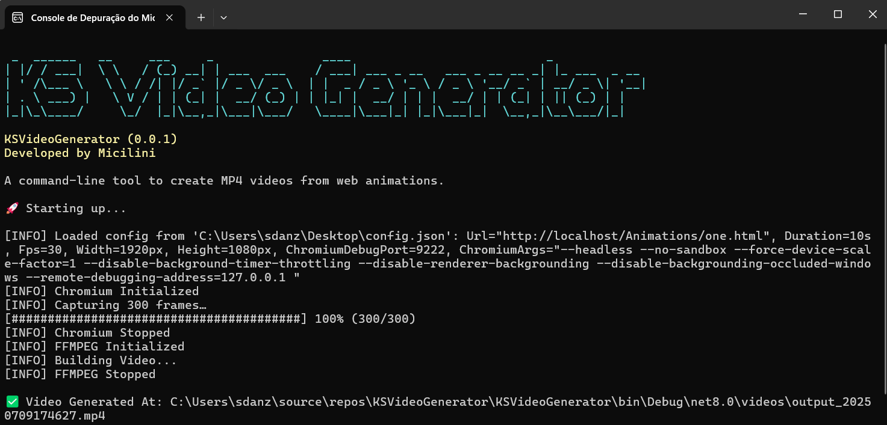

# KSVideoGenerator 



KSVideoGenerator (Key System Video Generator) is a zero-dependency .NET CLI tool and library that:

- Launches headless Chromium  
- Captures frames from any HTML/CSS/JS animation  
- Assembles them into an MP4 via FFmpeg  

⚡ **No external installs required** — Chromium and FFmpeg binaries are bundled.  
🌐 **Cross-platform** — runs out of the box on Windows & Linux.

If you want to Download the distribuition version of this library, just go to the [Releases page](https://github.com/micilini/KSVideoGenerator/releases/tag/Version0.0.1) :)

---

## Table of Contents

1. [Overview](#overview)  
2. [Features](#features)  
3. [Installation](#installation)  
   - [Windows](#windows)  
   - [Linux](#linux)  
4. [Configuration](#configuration)  
5. [Usage](#usage)  
   - [CLI](#cli)  
   - [Example: Node.js](#example-nodejs)  
   - [Example: Go](#example-go)  
   - [Known Issue: PHP](#known-issue-php)  
6. [Contributing](#contributing)  
7. [License](#license)  

---

## Overview

Point KSVideoGenerator at any URL (local or remote) and it will:

1. Spawn headless Chromium  
2. Snapshot frames at your FPS for a given duration  
3. Invoke FFmpeg to encode into an MP4  

Ideal for CI pipelines, documentation videos, demos, or embedding in larger apps.

---

## Features

- **Bundled binaries**: ships with Chromium & FFmpeg in `tools/`  
- **Cross-platform**: Windows & Linux support  
- **Configurable**: duration, FPS, resolution, Chromium flags  
- **Library mode**: consume via .NET API, CLI, Node.js, Go, etc.  
- **Lightweight**: minimal overhead, no global installs

---

## Installation

Ensure that you have Visual Studio Community 2022 with C# and .NET CORE 8 to runs this application.

```bash
git clone https://github.com/micilini/KSVideoGenerator.git
```

After that open ```KSVideoGenerator.sln``` with Visual Studio Community 2022.

### Prerequisites

- [.NET 8 SDK](https://dotnet.microsoft.com/download/dotnet/8.0)  
- Visual Studio 2022 (or VS Code with C# extension)

### Download & Extract “tools” Bundles

Go to the [Releases page](https://github.com/micilini/KSVideoGenerator/releases) and download:

- `ToolsX64-Linux-Windows-KSVideoGenerator-0.0.1.zip`   

Then extract each into your `tools/` folder:

```bash
# Windows bundle → extract into:
KSVideoGenerator/tools/windows-x64/

# Linux bundle → extract into:
KSVideoGenerator/tools/linux-x64/
```

After extraction your project should look like:

```bash
KSVideoGenerator/
├── tools/
│   ├── win-x64/
│   │   ├── chromium/
|           └── [others files...] 
│   │   │   └── chrome.exe
│   │   └── ffmpeg/
|           └── [others files...] 
│   │       └── ffmpeg.exe
│   └── linux-x64/
│       ├── chromium/
|           └── [others files...] ← (chmod +x)
│       │   └── chrome    ← (chmod +x)
│       └── ffmpeg/
|           └── [others files...] ← (chmod +x)
│           └── ffmpeg    ← (chmod +x)
└── KSVideoGenerator.sln
```

To ensure the ```tools/``` folder is published alongside your executable, add this to your .csproj:

```
<ItemGroup>
  <Content Include="tools\**\*.*">
    <CopyToOutputDirectory>Always</CopyToOutputDirectory>
  </Content>
</ItemGroup>
```

**Tip for VS Code**: open your ```.csproj```, paste the ```<ItemGroup>``` inside the ```<Project>``` element, save, and rebuild.

---

## Publish

You can use Visual Studio’s built-in Publish tool to produce self-contained, single-file executables for both Windows x64 and Linux x64. Follow these steps:

1. **Open the Publish dialog**  
   Right-click your project in Solution Explorer and choose **Publish…**.

2. **Create or edit a profile**  
   - Click **+ Create new profile** (or select an existing one).  
   - Choose **Folder** as the publish target and click **Next**.

3. **Configure profile settings**  
   In the **Profile Settings** pane, set:
   - **Profile name**: e.g. `FolderProfile`  
   - **Configuration**: `Release | Any CPU`  
   - **Target framework**: `.NET 8.0`  
   - **Deployment mode**: `Self-contained`  
     > Embeds the .NET runtime so end users don’t need to install anything.  
   - **Target runtime**:  
     - Choose `win-x64` to publish for Windows  
     - Choose `linux-x64` to publish for Linux  
   - **Destination**: folder of your choice (e.g. `publish/win-x64` or `publish/linux-x64`)

4. **Enable single-file (don't enable trimming)**  
   Expand **File Publish Options** and check:
   - **Produce single file**  

5. **Publish**  
   Click **Save** and then **Publish**.  
   You’ll find in your output folder:
   - A single executable (`.exe` on Windows, no extension on Linux)  
   - Any bundled libraries (if you opted out of trimming)  

6. **Repeat for each runtime**  
   Create one profile targeting `win-x64` and another for `linux-x64` to generate both binaries.

After publishing, don’t forget to:

- **Grant execute permissions** on the Linux binary:
  ```bash
  chmod +x publish/linux-x64/KSVideoGenerator

---

## Configuration

This application comes with a ```config.json``` file that can be used to configure:

```
{
  "url": "https://example.com/",
  "duration": 10.0,
  "fps": 30,
  "width": 1920,
  "height": 1080,
  "chromiumDebugPort": 9222,
  "chromiumArgs": "--headless --no-sandbox --disable-setuid-sandbox --disable-gpu --disable-dev-shm-usage --force-device-scale-factor=1 --disable-background-timer-throttling --disable-renderer-backgrounding --disable-backgrounding-occluded-windows --remote-debugging-address=127.0.0.1",
  "soundTrack": "C:\\Users\\sdanz\\Desktop\\KSVideoGenerator\\test-sound.mp3"
}
```

| Parameter           | Description                                      |
|---------------------|--------------------------------------------------|
| `url`               | Target page or local file                        |
| `duration` (seconds)| Total capture time                               |
| `fps`               | Frames per second                                |
| `width` / `height`  | Viewport dimensions                              |
| `chromiumDebugPort` | DevTools port for headless Chromium              |
| `chromiumArgs`      | Extra Chromium flags (see defaults above)        |
| `soundTrack`        | Sound (.MP3) used in video                       |

---

## Usage

After generating the executable for Windows or Linux, or downloading the project located inside [Releases page](https://github.com/micilini/KSVideoGenerator/releases).

You have two options for running this project.

### 1) Sending a JSON configuration file:

```bash
KSVideoGenerator --config ./config.json
```

### 2) Sending inline flags separately:

```bash
KSVideoGenerator \
  --url https://example.com \
  --duration 5 \
  --fps 24 \
  --width 1280 \
  --height 720 \
  --chromiumDebugPort 9222 \
  --chromiumArgs "--headless --no-sandbox --disable-dev-shm-usage" \
  --soundTrack "./audio.mp3"
```

### Example using NodeJS:

```
const { execSync } = require("child_process");
execSync("KSVideoGenerator --config ./config.json", { stdio: "inherit" });
```

### Example using GoLang:

```
package main

import (
  "log"
  "os/exec"
)

func main() {
  out, err := exec.Command("KSVideoGenerator", "--config", "config.json").CombinedOutput()
  if err != nil {
    log.Fatalf("Error: %v\n%s", err, out)
  }
  log.Println(string(out))
}
```

### Known Issue with PHP

Invoking directly via PHP‐FPM or Apache CLI may lack permissions.
**Workaround**: call from a cron job or via a Node/Go wrapper.

---

## Contributing

- Fork this repository  
- Create a branch: `git checkout -b feat/my-feature`  
- Commit your changes & open a PR  
- Ensure tests pass and follow code style  
- Update docs if needed  

## License

MIT © Micilini